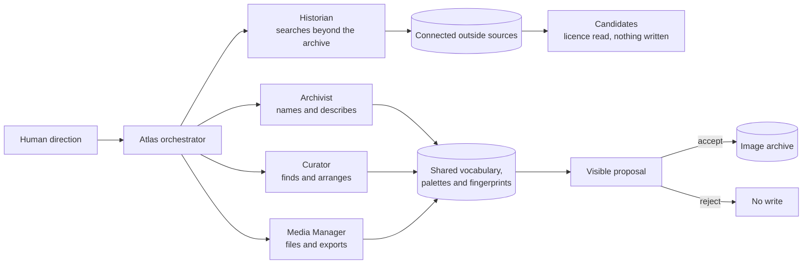

<p align="center">
  
</p>

# Agentic Archive

A multi-agentic dashboard for turning loose image folders into an art-direction-ready visual archive.

Agentic Archive helps designers, art directors, photographers, and visual researchers find, compare, sort, collect, and archive reference imagery. **Atlas**, its orchestrating agent, works through four specialized archetypes while the Network, Gallery, Analyze studio, and collection tools remain directly usable by hand.

> Agentic Archive is the workspace. Atlas is the agent inside it.

[Open the public read-only archive](https://archivist-agent.vercel.app)


## What it is for

- **Art direction:** assemble focused visual sets, compare references, and sort a field by color or light.
- **Image sorting:** search titles, descriptions, OCR, creators, prompts, and controlled keyterms.
- **Visual research:** explore similarity connections and move from one reference to related work.
- **Archiving:** deduplicate managed copies, organize nested collections, and export selected sets as real files.
- **Image analysis:** generate structured briefs covering material, lighting, technique, composition, color, context, critique, and differentiation.

## One agent, four archetypes

Atlas is one continuous agent with four capability lenses. They share the same vocabulary, palettes, fingerprints, working set, and visible activity history.



| Archetype | Role | Capabilities | Autonomy |
|---|---|---|---|
| **Archivist** | Names what an image is | controlled keyterms, searchable descriptions, creator attribution, duplicate checks, history | Proposes |
| **Curator** | Decides what belongs together | find, filter, expand similar, sort the canvas, build working sets and collections | Acts on the canvas |
| **Historian** | Searches beyond the archive | plans probes the way art history files a mood (synonyms, iconography, movements, named artists), sweeps the connected museums, Are.na and more, facets by kind, period and platform, reads licences | Read-only |
| **Media Manager** | Puts images where they live | create or append collections, keep sets in Atlas, export copies to disk | Proposes |

The Curator may change what is visible without changing the archive. The Historian may only look: its candidates open at their source and enter the library through no door but your accept. Folder and library changes are committed only after human acceptance.


## Product surfaces

### Network

An explorable field of image cards connected by visual similarity and shared metadata. Search naturally, filter with controlled keyterms, expand into related images, or ask Atlas to reform the field around an idea.

The Curator can arrange the visible set as a row-major grid:

- **By color:** a hue sweep with dark-to-bright ordering inside each band
- **By light:** darkest at the top, brightest at the bottom
- **Release:** return every image to its network position

### Gallery

Four ways of standing in front of the same archive, switched from a subnav:

- **Wall:** the continuously moving mosaic for broad scanning — hover to pause, scroll or drag to scrub
- **Icons:** a Finder-style grid, every piece shown whole and named
- **Details:** the archive as a ledger — one row per file with dimensions, kind, size, and date
- **Carousel:** one work at a time with a filmstrip, walked by arrow keys

Any view opens any image directly in Analyze, and the chosen view persists.

### Analyze

Upload an image or choose one from the archive to produce a structured art-direction brief:

- material and lighting
- aesthetic lineage and technique
- time period and historical context
- composition and color reading
- honest critique and differentiation
- controlled subjects, styles, moods, and medium

Continue with image-aware conversation, or stage two images as a diptych for structural, color, and qualitative comparison.

### Collections and archive tools

- Nested virtual folders
- Searchable notes, OCR, titles, descriptions, prompts, and creators
- Ratings, keep/reject flags, and manual tags
- Perceptual-hash and palette-based similarity
- Content-hash duplicate detection
- Copy-only export to a chosen folder
- Source originals left untouched

## Agent operating guidelines

Atlas follows six visible rules in the dashboard:

1. **One brain, four lenses.** Archetypes are capability namespaces, not competing personalities.
2. **Hand-off is shared data.** Every archetype works from the same vocabulary, palettes, fingerprints, and current field.
3. **Autonomy is explicit.** `ACTS` may change the canvas; `PROPOSES` may only stage a library change.
4. **Agent writes have one door.** A staged folder proposal becomes persistent only after acceptance.
5. **Local tools first.** Fingerprints, palettes, OCR, similarity, sorting, and collection operations run locally.
6. **Everything is visible.** Conversation, CTAs, `/` commands, and contextual triggers route to the same actions, with tool activity rendered in the thread.

## The agentic experience

Atlas lives in one panel docked to the Network stage, full height from the first message, with the field showing through behind it. Everything below is what a session actually feels like.

### The panel

- **An opener that stays.** Atlas says hello and names its four lenses in a sentence; that line is the first turn of every conversation, not a splash screen that gets wiped.
- **Quick asks above the field.** Find something, sort the canvas, save a folder, tag new images, other skills: one row of presets above the composer, scrolling sideways with fading edges, there on every turn.
- **`/` for everything.** Type `/` in the composer and every command is listed with the archetype that owns it; `/ledger` shows the session's own activity beside the archive's recent history.
- **Turns you can read.** Each reply is nested under a turn head that says which lens is working and on what, with every tool call rendered as a row: what was searched, how many came back, how many are keepable.

### Conversations

- **One open chat.** Typing continues the conversation you are in and lifts it to the top of the list. **New** starts an empty one and keeps the last.
- **History** rises over the chat area as a sheet: every kept conversation by its first ask, a dot on the open one, remove on hover, clear the rest with one link. Pick a row and that chat comes back with its title, its field and its light table. Conversations persist in the browser, capped by count and size, so a reload forgets nothing.

### Searching beyond the archive

- **Probes, not a query.** Ask for a mood and the Historian plans three to five probes in different registers, synonyms first, then the iconography, then the movements and named artists, because catalogues only match their own words. One probe sweeps every connected source at once.
- **A preview that ends.** A search with no number is a look, not a delivery: a few probes, then Atlas stops, says what is on the light table and about how much exists behind it, and offers the fork in one sentence: refine, pull more, or leave it. Name a number and it gathers toward it; say `more` and it continues past everything already delivered, never re-reading page one.
- **The light table.** Outside finds dock beside the panel on a temporary canvas, licence read, nothing written. They open at their source and enter the library through no door but your accept.
- **The refine card.** After a search, the controls are the card: colour, light and period as ramps, nine kinds of work, every connected platform (several at once), two lines in your own words, one verb. It composes a single sentence Atlas acts on, and the plumbing honours all of it: kinds and periods become facets at the museums that have them (the Met, the Art Institute, Cleveland, Europeana; the Rijksmuseum facets kind but not period), a kind a source cannot facet rides the query as a word, and a source that cannot narrow at all is named beside its results rather than silently unfiltered. A refinement that missed costs one click to undo.

### Connections

| Source | Reach | Facets |
|---|---|---|
| The Met, Art Institute of Chicago, Cleveland Museum of Art | open collections, keepable where the licence allows | kind and period |
| Rijksmuseum | open collection | kind |
| Europeana | aggregated European collections (needs a key) | kind and period |
| Are.na | public channels, walked as a person would name them | none: channels are curated, not catalogued |
| Pinterest | your own pins, once authorised | none |

Any source can be switched off under Agents, and a switched-off source is never reached, however the sweep is worded.

### What writes, and what only looks

The Curator changes what you see; the Historian only looks; the Archivist and the Media Manager propose. A folder is staged as a visible proposal and becomes persistent only when you accept it, and the ledger records who did what. On the public copy Atlas can search, filter, widen and re-form the field, and says so itself when asked to write.

### Kept honest

The behaviour above is checked, not assumed: the refine card and its plumbing against real museums and a real model on a disposable copy of the archive, the panel's memory by driving the real panel ([`scripts/history-drawer-test.mjs`](scripts/history-drawer-test.mjs)), the search's manners against a real model ([`scripts/agent-behaviour-test.mjs`](scripts/agent-behaviour-test.mjs)), and the record itself by the audit below.

## The Archivist agent

The repository includes the working [Archivist agent specification](.claude/agents/archivist.md) used to catalogue an image backlog. Its core discipline is simple:

- inspect every image rather than trusting filenames or OCR alone
- write concise, searchable descriptions of what is actually visible
- select keyterms from the controlled vocabulary instead of inventing captions
- attribute a creator only when the evidence is strong
- omit uncertain attribution because a wrong artist damages every future search

The canonical taxonomy lives in [`lib/taxonomy.ts`](lib/taxonomy.ts).

Two scripts keep the record honest: [`scripts/archivist-audit.ts`](scripts/archivist-audit.ts) asserts what the Archivist promises (one work, carrier and period per image; every keyterm inside the taxonomy; the brief and the keyterms agreeing; provenance and the ledger) and [`scripts/repair-record.ts`](scripts/repair-record.ts) makes it true again when they drift.

## Local-first architecture

Agentic Archive is local-first, not offline-only.

Managed image copies, SQLite metadata, perceptual hashes, palettes, OCR, and similarity data stay on the host machine. Atlas text requests use the configured Groq model. Invoking visual analysis sends a downscaled version of the selected image to the configured Groq vision endpoint. Source originals are read during ingest and are never modified.

```text
source folder
    | copy only
    v
managed library + SQLite
    | local fingerprints, palette, OCR, similarity
    v
Network / Gallery / Analyze / Collections
    | only when requested
    v
Groq language or vision model
```

## Public archive

The Vercel deployment is a read-only snapshot of the full visual catalog. It keeps the reviewed titles, descriptions, artists, controlled keyterms, collections, palettes, perceptual fingerprints, similarity graph, and analysis briefs available across Network, Gallery, and Analyze.

Public image delivery uses metadata-free WebP derivatives in Vercel Blob. The deployment catalog is generated from a transactionally consistent SQLite snapshot, with local source paths, original filenames, source hashes, embedded generation metadata, raw OCR, notes, and file timestamps removed before upload. Source originals and the writable `atlas.db` remain local.

The publisher is fail closed: new unindexed files and database schema changes require explicit review. Existing image blobs are byte-verified and never overwritten, and each sanitized SQLite catalog is published at a content-addressed path before Vercel builds against it.

Uploads, exports, model calls, and archive mutations stay disabled on the public deployment. The persistent working product continues to run locally because ingest, Windows OCR, disk export, and source-file management require durable host storage.

## Run locally

```bash
npm install
cp .env.example .env.local
npm run dev
```

Add `GROQ_API_KEY` to `.env.local` for Atlas and vision analysis.

Ingest a folder:

```bash
npm run ingest -- "C:/path/to/images" "Collection Name"
```

Useful archive passes:

```bash
npm run tag-local
npm run tag-backlog
npm run refine-tags
```

Requires Node.js 22 or newer because the catalog uses `node:sqlite`. Windows OCR is used when available and skipped on other platforms.

To run the synthetic hosted fallback locally:

```bash
ATLAS_DEMO=1 npm run dev
```

In PowerShell:

```powershell
$env:ATLAS_DEMO = "1"
npm run dev
```

## Stack

Next.js 16, React 19, TypeScript, `node:sqlite`, Sharp, canvas rendering, and Groq.

```bash
npx tsc --noEmit
npm run build
```

## Repository boundary

The private source library and writable `atlas.db` are intentionally excluded from Git. The repository contains the application, agent behavior, taxonomy, archive tooling, and synthetic fallback assets. Public releases are generated with `scripts/publish-public-archive.mjs`, stored in Vercel Blob, and fetched into the deployment during the build.
